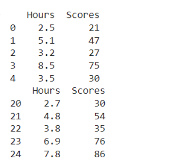
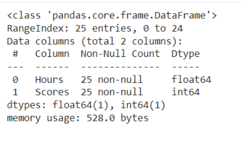
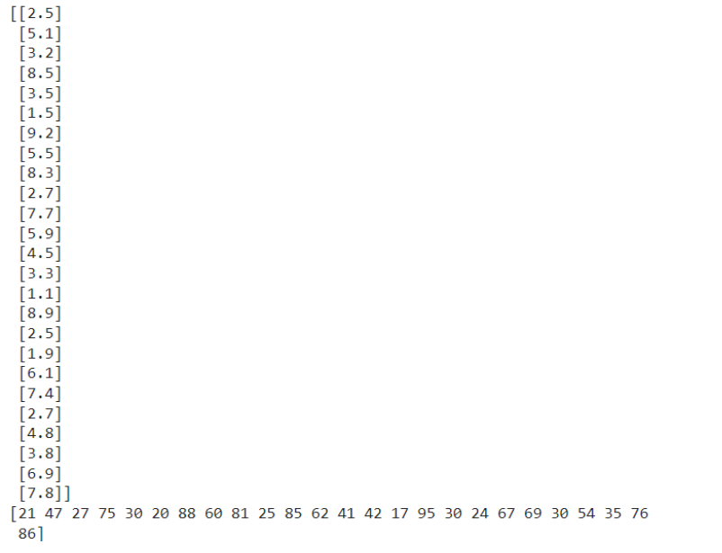
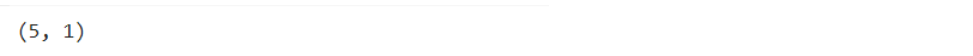
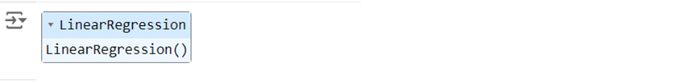
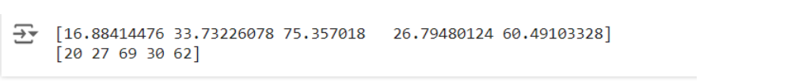
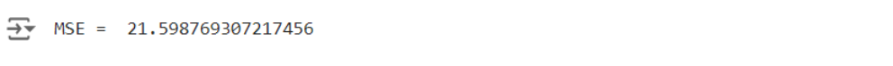
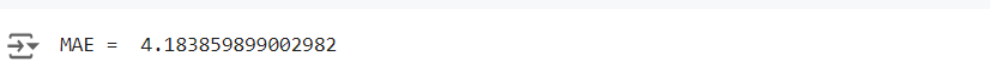

# Implementation-of-Simple-Linear-Regression-Model-for-Predicting-the-Marks-Scored

## AIM:
To write a program to predict the marks scored by a student using the simple linear regression model.

## Equipments Required:
1. Hardware – PCs
2. Anaconda – Python 3.7 Installation / Jupyter notebook

## Algorithm
1.Import the standard Libraries.

2.Set variables for assigning dataset values.

3.Import linear regression from sklearn.

4.Assign the points for representing in the graph.

5.Predict the regression for marks by using the representation of the graph.

6.Compare the graphs and hence we obtained the linear regression for the given datas.


## Program:
```
/*
Program to implement the simple linear regression model for predicting the marks scored.
Developed by: BHAVATHARANI S
RegisterNumber:212223230032  
*/
```
```
import numpy as np
import pandas as pd
from sklearn.metrics import mean_absolute_error,mean_squared_error
import matplotlib.pyplot as plt
```
```
dataset = pd.read_csv('/content/student_scores.csv')
print(dataset.head())
print(dataset.tail())
```

```
df.info()
```

```
x=dataset.iloc[:,:-1].values
print(x)
y=dataset.iloc[:,-1].values
print(y)
```

```
from sklearn.model_selection import train_test_split
x_train,x_test,y_train,y_test=train_test_split(x,y,test_size=0.2,random_state=0)
x_train.shape
```

```
from sklearn.model_selection import train_test_split
x_train,x_test,y_train,y_test=train_test_split(x,y,test_size=0.2,random_state=0)
x_train.shape
x_test.shape
```

```
from sklearn.model_selection import train_test_split
x_train,x_test,y_train,y_test=train_test_split(x,y,test_size=0.2,random_state=0)
x_train.shape
x_test.shape
from sklearn.linear_model import LinearRegression
reg=LinearRegression()
reg.fit(x_train,y_train)
```

```
y_pred=reg.predict(x_test)
print(y_pred)
print(y_test)
```

```
plt.scatter(x_train,y_train,color="green")
plt.plot(x_train,reg.predict(x_train),color="red")
plt.title('Traning set(H vs S)')
plt.xlabel("Hours")
plt.ylabel("scores")
plt.show()
plt.scatter(x_test,y_test,color="blue")
plt.plot(x_test,reg.predict(x_test),color="silver")
plt.title('Test set(H vs S)')
plt.xlabel("Hours")
plt.ylabel("scores")
plt.show()
```
```
mse = mean_squared_error(y_test, y_pred)
print('MSE = ', mse)
```

```
mae=mean_absolute_error(y_test,y_pred)
print('MAE = ',mae)
```

```
rmse=np.sqrt(mse)
print("RMSE = ",rmse)
```


## Output:


## Result:
Thus the program to implement the simple linear regression model for predicting the marks scored is written and verified using python programming.
